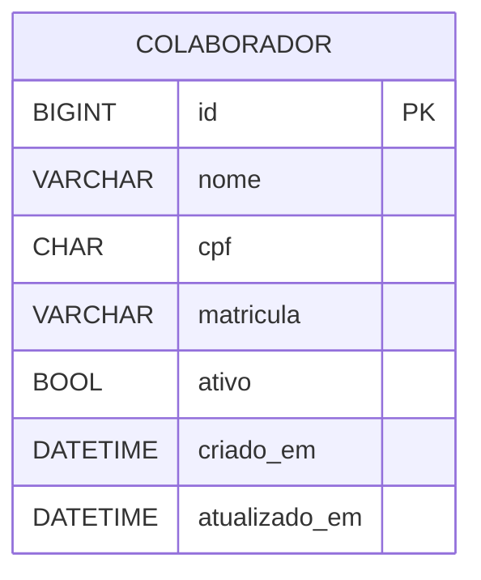
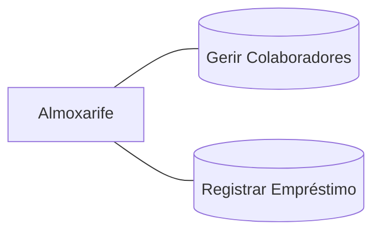

# EPI MVP — Etapa 2 (Django)

CRUD de **Colaboradores** com persistência em **MySQL**, desenvolvido em **Python/Django**.

## 📦 Tecnologias
- Django 4.2 (LTS)
- MySQL 8.0
- mysqlclient
- Bootstrap 5 (CDN)

## 🚀 Como executar (VS Code)
```bash
# 1) Clone / crie o projeto
# git clone https://github.com/<sua-conta>/epi-mvp.git
cd epi_mvp

# 2) Ambiente virtual
python -m venv .venv
# Windows: .venv\Scripts\activate
# Linux/Mac:
source .venv/bin/activate

# 3) Dependências
pip install -r requirements.txt

# 4) Configurar variáveis (copie e edite .env)
cp .env.example .env

# 5) Migrações
python manage.py makemigrations colaboradores
python manage.py migrate

# 6) Rodar
python manage.py runserver
# Abra http://127.0.0.1:8000/ (redireciona para /colaboradores/)
```

> Obs.: o banco configurado no `.env` (DB_NAME=epi_simplificado) deve existir em seu MySQL.

## 👤 Acesso ao admin (opcional)
```bash
python manage.py createsuperuser
# depois acesse: http://127.0.0.1:8000/admin/
```

## 🧭 Rotas principais
- `GET /colaboradores/` — lista com paginação e busca
- `GET /colaboradores/novo/` — formulário de criação
- `GET /colaboradores/<id>/editar/` — edição
- `GET /colaboradores/<id>/excluir/` — confirmação de exclusão

## 🗃️ Diagrama ER (Mermaid)

```mermaid
erDiagram
    COLABORADOR {
      BIGINT id PK
      VARCHAR nome
      CHAR cpf
      VARCHAR matricula
      BOOL ativo
      DATETIME criado_em
      DATETIME atualizado_em
    }
```

## 🧩 Caso de Uso (Mermaid)

```mermaid
flowchart LR
  U3[Almoxarife] --- UC3[(Gerir Colaboradores)]
  U3 --- UC5[(Registrar Empréstimo)]
```

## ✅ Requisitos cobertos
- CRUD completo de Colaboradores.
- Persistência MySQL via ORM.
- Validações de unicidade (CPF, matrícula).
- Busca e paginação.

## 🐳 Docker (opcional)
**Dockerfile**
```dockerfile
FROM python:3.11-slim

ENV PYTHONDONTWRITEBYTECODE=1
ENV PYTHONUNBUFFERED=1

RUN apt-get update && apt-get install -y \
    build-essential default-libmysqlclient-dev gcc \
    && rm -rf /var/lib/apt/lists/*

WORKDIR /app
COPY requirements.txt /app/
RUN pip install --no-cache-dir -r requirements.txt

COPY . /app/

ENV DJANGO_SECRET_KEY=dev-secret-change-me
ENV DEBUG=1
EXPOSE 8000

CMD ["bash", "-lc", "python manage.py migrate && python manage.py runserver 0.0.0.0:8000"]
```

**docker-compose.yml** (exemplo)
```yaml
version: "3.8"
services:
  db:
    image: mysql:8.0
    environment:
      MYSQL_DATABASE: epi_simplificado
      MYSQL_ROOT_PASSWORD: root
    ports: ["3306:3306"]
    command: --default-authentication-plugin=mysql_native_password
  web:
    build: .
    environment:
      DB_NAME: epi_simplificado
      DB_USER: root
      DB_PASSWORD: root
      DB_HOST: db
      DB_PORT: 3306
      DJANGO_SECRET_KEY: dev-secret-change-me
      DEBUG: 1
      ALLOWED_HOSTS: 0.0.0.0,localhost,127.0.0.1
    ports: ["8000:8000"]
    depends_on: [db]
```

## 🧪 Teste rápido
1. Suba o MySQL (local ou via docker-compose).
2. `python manage.py migrate`
3. Acesse `/colaboradores/`, crie/edite/exclua, e verifique no banco.

---

Feito com ❤️ para a Etapa 2.
